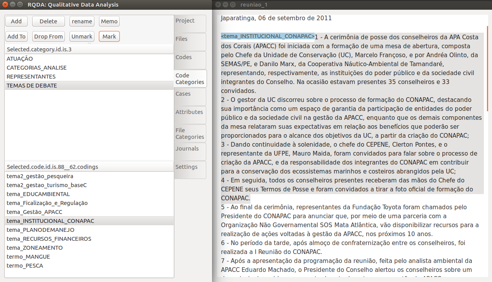

```{r setup, include=FALSE}
knitr::opts_chunk$set(echo = TRUE)
```

## Introdução

A Análise de Conteúdo é uma técnica para construir inferências a partir da identificação de características específicas de mensagens e textos, de forma sistemática e objetiva (HOLSTI, 1968). Sob a perspectiva quantitativa a AC tem um caráter objetivo e sistemático, implementando técnicas que busquem a mensuração, na qual se conta a frequência em que palavras ou conjunto de palavras se repetem e sua proximidade (FRANZOSI, 2010). Já a perspectiva qualitativa permite observar o universo do assunto tratado, sob uma abordagem que trata o objeto de uma maneira mais profunda, assim o(a) pesquisador(a) é capaz de construir uma perspectiva mais completa a respeito do objeto de estudo (BERG, 2001).

Os Conselhos Gestores de UCs, por sua vez, devem disponibilizar seus documentos internos para que seja garantida a transparências dessas instituições de gestão pública.  Esses documentos incluem: regimento interno (regula o funcionamento do conselho), ata de presença das reuniões, ata e memória das reuniões (descrevendo o decorrer da reunião), dentre outros. 

Dessa forma, podemos analise a grau de participação dos conselheiros das UCs, categorizando a *situação de fala* de cada um e posteriormente agregando essa informações pelos grupos setoriais a que cada conselheiro pertence.

</br>

# Introdução ao R

### Operações matemáticas simples

A funcionalidade mais básica do R é atuar como uma calculadora. Podemos fazer alguns cálculos básicos como:


```{r, results=FALSE}
3 + 5               # soma
183082 - 21982      # subtracao
92 * 1.6            # multiplicacao
900 / 30            # divisao
40**2               # exponencial
```

### Funções

Uma *Função* é um *comando* que irá executar uma série de tarefas que lhe foi designada. Tudo o que *acontece* no R é uma Função. A Função sqrt() , por exemplo, nos retorna a raiz quadrada do que estiver entre parênteses:

```{r}
sqrt(9)
```

[^1]: Os argumentos de uma função são as informações que ela necessita para ser executada.

O R também trabalha com operações lógicas,  retornando TRUE ou FALSE a partir da lógica que testamos.

```{r}
2 == 3       # 2 igual a 3
2 != 3       # 2 diferente de 3
2 < 3        # 2 menor do que 3
2 <= 3       # 2 menor ou igual a 3
2 > 3        # 2 maior do que 3
2 >= 3       # 2 maior ou igual a 3
```

## Tipos de objetos no R

Os objetos no R podem armazenar diferentes tipos de informação. As caracteristicas dessas informações e como elas estão organizadas definirão a classe do objeto que as armazena.

A Função c() concatena elementos de um mesmo tipo que estão entre parênteses. Ela se faz necessária na criação de um objeto com mais de uma dimensão. Vale salientar que no R as informações são separadas por ',' (virgula) e a decimal por '.' (ponto). 


### Logical (lógico)
```{r}
x1 <- c(TRUE, FALSE)   # combina os valores TRUE e FALSE e atribui a x1
x1
class(x1)
```
**Atenção!** Como podemos observar, para criar objetos do tipo lógico, devemos escrever os valores `r TRUE` ou `r FALSE` em maiúsculo.

### Integer (quantitativa discreta)
```{r}
x2 <- 1:10           # combina os numeros inteiros de 9 a 29 e atribui a x2 
x2
class(x2)
```


### Character (qualitativa nominal)
```{r}
nome <- c("Fulano", "Sicrano", "Beltrano") 
nome
class(nome)
```
**Atenção!** Como podemos observar, para criar objetos do tipo character, devemos colocar as informações entre aspas.

### Numeric (quantitativa continua)
```{r}
altura <- c( 1.72, 1.58, 2.01) 
altura
class(altura)
```

### Data Frame (base de dados)
```{r}
dados_altura <- data.frame(nome, altura)
dados_altura
class(dados_altura)
```

## Manipulação e Tratamento de Dados

### 1. Importar Visualizar Bases de Dados

```{r}
acid16 <- read.csv("data/acidentes-transito-2016.csv",  # nome do arquivo entre aspas
                                    sep=";",                        # separador
                                    stringsAsFactors=FALSE,         # importar string como fatores, falso
                                    encoding = 'UTF-8')             # encoding do arquivo
```

Para visualizar as informações contidas em uma base de dados podemos usar uma série de ferramentas no R. Dentre elas:

```{r, eval=FALSE}
str(acid16)   # estrutura do base, com informacoes sobre o base em si e suas variaveis

View(acid16)  # Abre uma janela no RStudio [NAO RECOMENDADO PARA BASES GRANDES]

dim(acid16)   # Visualizar as dimensões do base

head(acid16)  # Visualizar primeira linhas do base

tail(acid16)  # Visualizar ultimas linhas do base
```

## 2. Manipular Estrutura da Base

```{r, results='hide',message=FALSE}
# selecionar primeira coluna no base
acid16[,1]

# selecionar um conjunto de colunas na base por posicao
acid16[,1:3]

# selecionar um conjunto de colunas no base por nome
acid16[,c('situacao','data','bairro')]

# selecionar primeira linha no base
acid16[1,]

# remover primeira coluna no base e atribuir a novo objeto
acid16_2 <- acid16[,-1]

# remover 10 primeiras linha no base
acid16_2 <- acid16_2[-c(1:10),]

# visualizar base acid16_2
head(acid16_2)
```
## 2. Condicionais e Transformação de Variáveis

As vezes você quer ir além de simplesmente selecionar uma coluna ou linha especifica. Você pode querer selecionar apenas os casos de acidentes em que houve vítima, os que envolveram ciclistas ou ainda os que envolveram moto ou caminhão e deixaram vítima. Para tal podemos trabalhar com operações lógicas utilizando as informações que aprendemos até agora. 

```{r,message=FALSE}
# as.factor() transforma um vector em factor (vetor com informacao categorica)
acid16$tipo <- as.factor(acid16$tipo)

# ver categorias na variavel
levels(acid16$tipo)

# selecionar pelo nome da coluna
vit16 <- acid16[acid16$tipo == "COM VÍTIMA",]

# transformar variavel em numerica
vit16$ciclista <- as.numeric(vit16$ciclista)

# selecionar pelo index da colunas
ciclista <- acid16[acid16$ciclista == 1,]
```

# Análise de Conteúdo em R

### 1. Instalando e carregando pacotes

```{r, eval=FALSE}
# instalar pacotes para a análise
install.packages(c("RQDA", "readxl", "readr", "stringi", "stringr", "plyr", "dplyr", "ggplot2"))
```

```{r, message=FALSE, warning=FALSE}
# carregar pacotes
library(readxl); library(ggplot2); library(readr); library(stringi); 
library(stringr); library(plyr); library(dplyr); library(RQDA)
```

### 2. R Qualitativa Data Analysis (RQDA)

RQDA é um pacote R para performar análises de dados qualitativas, mais especificamente para análise de textos. Sua principal funcionalidade é a codificação de textos, em que no caso aqui apresentado servirá para identificar (1) temas de debate nas reuniões, (2) situações de fala dos representantes. Com a incorporação de outras técnicas como análise de redes podemos identificar também a proximidade entre grupos e temas específicos. Abaixo segue orientações de como utilizar o pacote e em seguida alguns exemplos 

```{r, eval = F}
# executar o pacote RQDA
library(RQDA)
RQDA()
```

Após carregar e executar o pacote, será berta uma janela externa. Crie um novo projeto e nomei-o como desejar. Em seguido será mostrado as opções do projeto. Vá em "Files" e em seguida importe o arquivo .txt que será analisado.


Após importados os arquivos vá em codes e crie os códigos necessários para sua análise. No caso implementado foram utilizados códigos relativos aos temas de debate e também cada representante recebeu um código, de forma que ao final da codificação haja uma contagem de quantas vezes foram debatidos cada tema e quantas vezes cada representante levantou voz no Conselho. Para codificar, selecione com o cursor do mouse o texto para codificação e clique em "Mark".



### 2.1 Saliência de Temas

Após as codificações completadas as codificações dos temas debatidos nas reuniões, é possível responder à pergunta "quais são os temas mais e menos debatidos nas reuniões do Conselho". Essa informação reflete qual o foco do Conselho de modo a identificar quais temas são mais salientes ou problemáticos para os atores do contexto em questão. Abaixo seguem os códigos necessários para capturar as informações relativas aos códigos.

```{r, eval = FALSE, echo=FALSE, results='hide',message=FALSE}
# salvar codigos em arquivo para leitura markdown
sumario_cod <- summaryCodings()
cont_cod_data <- data.frame(sumario_cod$NumOfCoding)
write.csv(cont_cod_data, "data/cont_cod_data.csv", row.names = F)

# infos sobre cada codificacao
coding_table <- getCodingTable()
write.csv(coding_table, "data/coding_table.csv", row.names = F)
```

```{r, eval = FALSE}
# capturar informacoes dos codigos
sumario_cod <- summaryCodings()

# selecionar contagem de cada codigo
cont_cod_data <- data.frame(sumario_cod$NumOfCoding)
```

```{r, echo=FALSE, results='hide',message=FALSE}
cont_cod_data <- read_csv("data/cont_cod_data.csv")
coding_table <- read_csv("data/coding_table.csv")
```

```{r}
# selecionar codigos relativos ao tema 
# (durante a codificacao foi usado o termo 'tema_' para ajudar na separacao das informacoes)
cont_cod_tema <- cont_cod_data[str_detect(cont_cod_data$Var1, "tema_"),]

# visualizar base
cont_cod_tema

# criar variavel de  proporcao de cada tema em relacao ao total
cont_cod_tema <- mutate(cont_cod_tema, prop_tema = round((Freq / sum(Freq))*100, 2) )

# ordenar os valores
cont_cod_tema$Var1 <- factor(cont_cod_tema$Var1, 
                             levels = cont_cod_tema$Var1[order(cont_cod_tema$prop_tema)])

# visualizar graficamente e salvar
ggplot(cont_cod_tema, aes(x = Var1, y = prop_tema))+
  geom_bar(stat = "identity", fill = "#15041c") +
  geom_label(aes(x = Var1, y = prop_tema, label = prop_tema), size = 3.5)+
  labs(y = "Procentagem do Total", x = "", title = "") +
  coord_flip()+
  ggsave("prop_debate_tema.png", path = "results",width = 7, height = 3, units = "in")
```

### 2.2 Proporção de Fala

Outra possibilidade é a contagem de situções de fala por grupo de interesse. Isso é de extrema importância e uma análise inovadora visto que a maioria das análises de participação consideram apenas a presença dos representantes em plenária, enquanto a preponderância da fala fica à margem. A fala assume um caráter essencial no debate público, visto que é a partir da racionalização discursiva e do processo comunicativo que os atores conseguem chegar a decisões coletivas (HABERMAS).

```{r}
# selecionar codigos que nao sao de representantes 
paste_voz<- c("cat_", "tema_", "DESTAQUES", "DUVIDA_", "atua_", "DECISOES", "termo_", "tema2_", "IDENT_MEMO")
cont_cod_rep <- cont_cod_data[!str_detect(cont_cod_data$Var1, paste(paste_voz, collapse = '|')),] 

# Carregar base de dados de conselheiros e categorias das suas respectivas intituicoes
representantes_instituicoes_apacc <- read_excel("data/representantes_instituicoes_apacc.xlsx")

# funcao para padronizar nomes
cleanString <- function(x){
  library(plyr); library(stringi); library(stringr)
  x_mani = stri_trans_general(x, "Latin-ASCII")%>%
    str_replace_all("_", " ")%>%
    tolower()
  return(x_mani)
}

# executa funcao
representantes_instituicoes_apacc$nome_consel <- cleanString(representantes_instituicoes_apacc$nome_consel)
cont_cod_rep$nome_consel <- cleanString(cont_cod_rep$Var1)

# mergir bases
participaData <- merge(cont_cod_rep, representantes_instituicoes_apacc, by = "nome_consel") 

# retirar contagem do presidente do conselho e dos analistas*
participaData <- participaData[participaData$entidade_sigla != "ICMBIO",]

# contagem por grupo
participa_cont <- aggregate(participaData$Freq, by=list(Category=participaData$categoria1), FUN=sum)

# inserir info de assentos na base
participa_cont$numero_assentos <- c(6, 6, 12, 8, 3, 3)

# calcular proporcionalidade
participa_cont <- mutate(participa_cont, participaProp = round((x/numero_assentos),1))

# renomear para grafico
participa_cont$Category <- as.character(participa_cont$Category)
participa_cont$Category[6] <- "Organizações de educação e cultura \n e associações comunitárias"

# ordenar
participa_cont$Category <- factor(participa_cont$Category, 
                              levels = participa_cont$Category[order(participa_cont$participaProp)])
# grafico comparativo
ggplot(participa_cont, aes(x = Category, y = participaProp))+
  geom_bar(stat = "identity", fill = "#15041c") +
  geom_label(aes(label = participaProp), size = 3.5)+
  labs(y = "Número de Situações de Fala por Assento", x = "", title = "") +
  coord_flip()+
 ggsave("prop_voz_cat.png", path = "results", width = 8, height = 3, units = "in")

```

