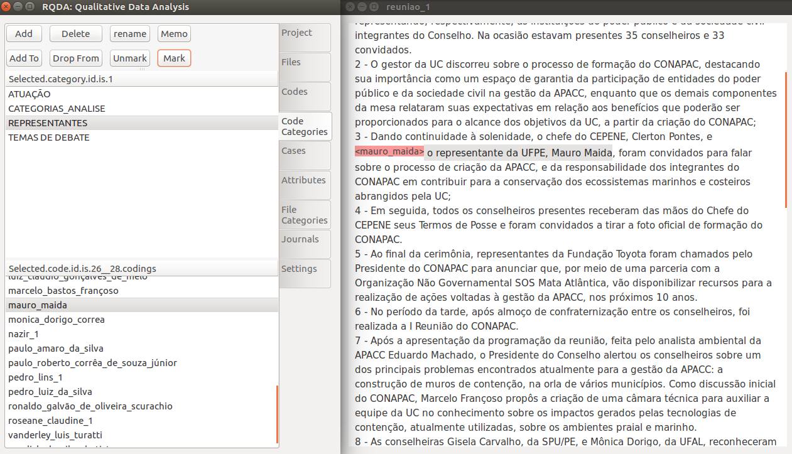

```{r setup, include=FALSE}
knitr::opts_chunk$set(echo = TRUE)
```
# **Metodologia de Análise da Participação Social em Instituições Deliberativas**

## INTRODUÇÃO

Instituições de participação na gestão pública desempenham um papel crucial no exercício da Democracia. No Brasil pó-ditadura alguns mecanismos dessa natureza foram criados: conselhos gestores, orçamentos participativos, fóruns nacionais, que são instâncias de suma importância para uma maior aproximação dos indivíduos com a execução de políticas públicas no nível local e regional (CONSTITUIÇÃO). Estas instituições viabilizam e identificam demandas da sociedade, promovem a construção da cidadania e da educação política e permitem o controle social sobre as decisões governamentais (GOMES, 2003).

</br>

Uma das competências do Ministério do Meio Ambiente (MMA) do Brasil é gerir as Unidades de Conservação (UCs) dentro do território brasileiro, por meio do Instituto Chico Mendes de Conservação da Biodiversidade (ICMBio). Uma Unidade de Conservação é um “espaço territorial e seus recursos ambientais, [...] com características naturais relevantes, legalmente instituído pelo Poder Público, com objetivos de conservação e limites definidos, sob regime especial de administração, ao qual se aplicam garantias adequadas de proteção” (LEI 9.985/2000). Este é um importante instrumento para garantir a preservação da biodiversidade, uso sustentável do meio ambiente, e desenvolvimento das comunidades que ali residem, frente ao consumo e à destruição de habitats naturais pela sociedade.

</br>

Para que a gestão de uma área protegida seja efetiva, é essencial que haja um espaço pelo qual as comunidades que vivem no território participem das decisões sobre a gestão do mesmo, num ambiente de interação com gestores, pesquisadores e profissionais que ali atuam (FERSE et al). No âmbito da política de UCs, é criado o mecanismo de Conselho Gestor, no qual representantes de instituições e grupos locais podem trazer questões para serem debatidas com os gestores da área (conselhos consultivos) e até decidir sobre a execução das políticas (conselhos deliberativos) (ICMBIO CITAR guia).

</br>

Este trabalho se propõe desenvolver uma metodologia de análise de conselhos gestores de áreas protegidas, utilizando software livre. A partir de documentos internos dos conselhos é possível estruturar o texto desses documentos em categorias de análise -- levantadas a partir da literatura adotada -- e posteriormente analisá-las em quantitativamente (frequências de palavras, conexão entre categorias) e qualitativamente (interpretação e mecanismos) (BARDIN). A partir da pergunta “a participação política no conselho é democrática?”, é desenvolvido um desenho para analisar o Conselho Consultivo da Área de Proteção Ambiental Costa dos Corais. Aqui pretende-se orientar outras pesquisas na análise desse importante mecanismo institucional, utilizando a Linguagem R e o pacote RQDA.

</br>

## QUESTÃO DE PESQUISA

Como analisar a participação social em ambientes deliberativos, usando software livre?

</br>

## JUSTIFICATIVA
Ambientes de participação política são essenciais para uma aproximação da gestão da política pública com o público-alvo, identificando as demandas da sociedade, reconhecendo o conhecimento que os que vivem no território possuem sobre o mesmo,  mediando os conflitos entre grupo locais. Conselhos de Unidades de Conservação são marcados por conflitos, que geralmente se dão entre grupos com interesses econômicos na área, gestores públicos, pesquisadores e comunidades locais.  

[PORQUE ELA DEFASADA POR QUE ELA NECESSARIA]

</br>

## METODOLOGIA
A partir das diretrizes de Bardin (ANO) para desenvolver uma análise de conteúdo, é explorada a vias de análise de documentos de Conselhos Gestores de UCs. A Análise de Conteúdo é uma técnica para construir inferências a partir da identificação de características específicas de mensagens e textos, de forma sistemática e objetiva (HOLSTI, 1968). Sob a perspectiva quantitativa a AC tem um caráter objetivo e sistemático, implementando técnicas que busquem a mensuração, na qual se conta a frequência em que palavras ou conjunto de palavras se repetem e sua proximidade (FRANZOSI, 2010). Já a perspectiva qualitativa permite observar o universo do assunto tratado, sob uma abordagem que trata o objeto de uma maneira mais profunda, assim o(a) pesquisador(a) é capaz de construir uma perspectiva mais completa a respeito do objeto de estudo (BERG, 2001).

</br>

## PARTICIPAÇÃO SOCIAL

[]

</br>

## ANÁLISE DE CONTEÚDO E CONSELHOS GESTORES

Uma vez que o pesquisador possua uma fonte de informação como entrevistas, vídeos, ou qualquer mecanismo que possa ser transformado em texto, ele precisa escolher uma forma de analisar esses dados, essa forma é chamada de análise de conteúdo. Nesse sentido a análise de conteúdo seria "any technique for making inferences by systematically and objectively identifying special characteristics of messages" (Hoisri, 1968, p. 608). O método Análise de conteúdo possui como principal regra o critério de seleção e de análise dos casos. O critério de seleção é a forma como o pesquisador olhará para seus casos precisa estar bastante explícito para os leitores e outros pesquisadores.  Esse processo de critério de seleção e forma de análise deve ser capaz de gerar categorias analíticas, que por sua vez permitiriam o surgimento da comparabilidade e da validade nas palavras de Selltiz (1967): "this may be considered a kind of reliability of the measures, and a validation of eventual findings".

</br>

Tendo definido análise de conteúdo como método, agora precisamos entender um pouco sobre as diferentes abordagens possíveis. A primeira das abordagens seria uma análise de conteúdo de caráter (1) Quantitativo, Berelson (1952) sugeriu " objective, systematic, and quantitative" como forma de se fazer uma análise de conteúdo. Esse método foca sua atenção muito mais no procedimento da análise do que nas características dos dados disponíveis. É comum tentar implementar modelos que busquem a mensuração, onde se contaria a frequência em que palavras ou conjunto de palavras se repetem, sua proximidade, ou ainda outros elementos textuais. A perspectiva quantitativa busca transformar textos em números e saber que dessa forma a abordagem pode esbarrar em uma série de limitações.  

</br>

Outra forma seria a (2) Qualitativa em que seguindo suas diretrizes os pesquisadores conseguiriam observar melhor o universo do assunto tratado. Assim, teriam uma abordagem que olharia o objeto de uma maneira mais profunda e – principalmente – visava a não exclusão de termos não quantificáveis, os pesquisadores seriam capazes de construir  uma  perspectiva mais completa a respeito do objeto de estudo. Do ponto de vista de uma abordagem qualitativa a análise de conteúdo se tornaria uma "opportunity for the investigator to learn about how subjects or the authors of textual. materials view their social worlds. From this perspective, content analysis is not a reductionistic, positivistic approach" (Berg, 1989).

</br>

Os Conselhos Gestores de UCs devem disponibilizar seus documentos internos para que seja garantida a transparências dessas instituições de gestão pública.  Esses documentos incluem: regimento interno (regula o funcionamento do conselho), ata de presença das reuniões, ata e memória das reuniões (descrevendo o decorrer da reunião), dentre outros.

</br>

## ANÁLISE DE CONTEÚDO EM SOFTWARE LIVRE

### 1. Presença Total em Reuniões

Participar do processo deliberativo num conselho gestor é essencial para levantar as questões de interesse de cada representante, também para estar ciente do que está sendo debatido, assim como aprender sobre os processos envolvidos na participação. A análise da presença dos participantes no conselho gestor nos fornece a possibilidade de identificar quais grupos e instituições mais comparecem às reuniões e qual a evolução histórica disso. No exemplo em questão foram utilizados as atas de presença da reunião para reunir as informações de presença de cada conselheiro(a) em cada reunião do Conselho. As informações de presença foram tabuladas em formato Excel e podem ser baixadas [aqui](https://github.com/claudioalvesmonteiro/publicgov_environment/blob/master/apa_costa_dos_corais/data/atas_preseca_apacc.xlsx).

</br>

#### 1.1 Baixando e carregando os arquivos

Foi possível computar as seguintes informações de cada representante: (1) nome; (2) sexo; (3) presença/ausência na reunião; (4) número da reunião e (5) representante suplente ou titular. Para realizar as análises desta sessão é necessário baixar as bases de exemplo. Segue abaixo o codigo necessario para baixar e carregar a base de dados.


```{r}
# baixar dados
url <- "https://bit.ly/2zrirIX"
destfile <- "atas_presenca_apacc.xlsx"
download.file(url, destfile)

# carregar dados
library(readxl)
apacc_data <- read_excel("atas_presenca_apacc.xlsx")
```


```{r}
# baixar dados
url <- "https://bit.ly/2m8xhux"
destfile <- "instituicoes_apacc.xlsx"
download.file(url, destfile)

# carregar dados
apacc_insti <- read_excel("instituicoes_apacc.xlsx")
```

#### 1.2 Presença Total por Instituição

```{r}
# contabilizar presenca por instituicao
presen_insti <- aggregate(apacc_data$presente, 
                by = list(apacc_data$entidade_sigla), sum)

# ordenar os nomes das instituicoes com base na presenca
presen_insti$Group.1  <- factor(presen_insti$Group.1, 
                         levels = unique(presen_insti$Group.1[order(presen_insti$x)]), ordered = TRUE)
```

```{r,  fig.width=6, fig.height=8}
# carregar pacote para graficos
library(ggplot2)

# grafico em ggplot
ggplot(
  # selecionar base de dados, eixo x e y
  presen_insti, aes(x = presen_insti$Group.1, y = presen_insti$x))+ 
  # define statistica do grafico e cor de preenchimento
  geom_bar(stat = "identity", fill = "black") +
  # define titulo dos eixos e grafico
  labs(x = "", y = "Número de Presentes") +
  # virar coordenadas
  coord_flip()

# salvar grafico
ggsave("Resultados/barra_instituicoes.png", width = 4, height = 8, units = "in")
```

#### 1.3 Presença por Grupo Setorial

Cada instituição compõe um grupo setorial que, segundo o próprio Conselho define, são classificadas em (1) Atividade Turística; (2) Atividade Pesqueira; (3) Gestão Pública; (4) ONGs Ambientalistas; (5) Organizações de educação e cultura e associações comunitárias; e (6) Agricultura, Indústria e Comércio. Para tal classificação foram utilizadas as atas de memória onde houveram eleições, com a categorização de cada instituição.

```{r,  fig.width=6, fig.height=3}
# transformar em caixa alta e mergir colunas
presen_insti$entidade_sigla <- toupper(presen_insti$Group.1)

# criar base de categorias das instituicoes
cat_grupo <- apacc_insti[!duplicated(apacc_insti$entidade_sigla),-c(1)]

# mergir informacoes
apacc_pres_grupo <- merge(presen_insti, cat_grupo, by = "entidade_sigla", all = T)

# somar presencar por grupo setorial
presen_grupo <- aggregate(apacc_pres_grupo$x, 
                by = list(apacc_pres_grupo$categoria1), sum)

# alterar nome para plotagem 
presen_grupo$Group.1[7] <- "Organizações de educação e cultura \n e associações comunitárias"

# ordenar base para plotagem
presen_grupo$Group.1  <- factor(presen_grupo$Group.1, 
                         levels = presen_grupo$Group.1[order(presen_grupo$x)])
# grafico
ggplot(presen_grupo, aes(x = presen_grupo$Group.1, y = presen_grupo$x))+ 
  geom_bar(stat = "identity", fill = "black") +
  geom_label(aes(label = x), size = 3.5)+
  labs(x = "", y = "Número de Presentes") +
  coord_flip()

# salvar grafico
ggsave("Resultados/presenca_grupo_setor.png", width = 6, height = 3, units = "in")
```

[+ PROPORCIONAL NUMERO DE ASSENTOS]


### 2. Possibilidades de Análise com o pacote RQDA

RQDA é um pacote R para performar análises de dados qualitativas, mais especificamente para análise de textos. Sua principal funcionalidade é a codificação de textos, em que no caso aqui apresentado servirá para identificar (1) temas de debate nas reuniões, (2) situações de fala dos representantes. Com a incorporação de outras técnicas como análise de redes podemos identificar também a proximidade entre grupos e temas específicos. Abaixo segue orientações de como utilizar o pacote e em seguida alguns exemplos 

```{r, eval = F}
# instalar e carregar pacotes
install.packages(c("RQDA", "readxl", "readr", "stringi", "stringr", "plyr", "dplyr", "ggplot2"))

# execute o pacote
library(RQDA)
RQDA()
```

```{r, warning=FALSE}
# carregar demais pacotes
library(readxl); library(readr); library(stringi); library(stringr);
library(plyr); library(dplyr); library(ggplot2); library(RQDA)
```

Após carregar e executar o pacote, será berta uma janela externa. Crie um novo projeto e nomei-o como desejar.


Em seguido será mostrado as opções do projeto. Vá em "Files" e em seguida importe o arquivo .txt que será analisado.


Após importado os arquivos vá em codes e crie os códigos necessários para sua análise. No caso implementado foram utilizados códigos relativos aos temas de debate e também cada representante recebeu um código, de forma que ao final da codificação haja uma contagem de quantas vezes foram debatidos cada tema e quantas vezes cada representante levantou voz no Conselho. Para codificar, selecione com o cursor do mouse o texto para codificação e clique em "Mark".





### 2.1 Saliência de Temas

Após as codificações completadas as codificações dos temas debatidos nas reuniões, é possível responder à pergunta "quais são os temas mais e menos debatidos nas reuniões do Conselho". Essa informação reflete qual o foco do Conselho de modo a identificar quais temas são mais salientes ou problemáticos para os atores do contexto em questão. Abaixo seguem os códigos necessários para capturar as informações relativas aos códigos.

```{r, eval = FALSE, echo=FALSE, results='hide',message=FALSE}
# salvar codigos em arquivo para leitura markdown
sumario_cod <- summaryCodings()
cont_cod_data <- data.frame(sumario_cod$NumOfCoding)
write.csv(cont_cod_data, "Dados/cont_cod_data.csv", row.names = F)

# infos sobre cada codificacao
coding_table <- getCodingTable()
write.csv(coding_table, "Dados/coding_table.csv", row.names = F)
```

```{r, eval = FALSE}
# capturar informacoes dos codigos
sumario_cod <- summaryCodings()

# selecionar contagem de cada codigo
cont_cod_data <- data.frame(sumario_cod$NumOfCoding)
```

```{r, echo=FALSE, results='hide',message=FALSE}
cont_cod_data <- read_csv("Dados/cont_cod_data.csv")
coding_table <- read_csv("Dados/coding_table.csv")
```

```{r}
# selecionar codigos relativos ao tema 
# (durante a codificacao foi usado o termo 'tema_' para ajudar na separacao das informacoes)
cont_cod_tema <- cont_cod_data[str_detect(cont_cod_data$Var1, "tema_"),]

# visualizar base
cont_cod_tema

# criar variavel de  proporcao de cada tema em relacao ao total
cont_cod_tema <- mutate(cont_cod_tema, prop_tema = round((Freq / sum(Freq))*100, 2) )

# ordenar os valores
cont_cod_tema$Var1 <- factor(cont_cod_tema$Var1, 
                             levels = cont_cod_tema$Var1[order(cont_cod_tema$prop_tema)])

# visualizar graficamente e salvar
ggplot(cont_cod_tema, aes(x = Var1, y = prop_tema))+
  geom_bar(stat = "identity", fill = "#15041c") +
  geom_label(aes(x = Var1, y = prop_tema, label = prop_tema), size = 3.5)+
  labs(y = "Procentagem do Total", x = "", title = "") +
  coord_flip()+
  ggsave("prop_debate_tema.png", path = "resultados",width = 7, height = 3, units = "in")
```

### 2.2 Proporção de Fala

Outra possibilidade é a contagem de situções de fala por grupo de interesse. Isso é de extrema importância e uma análise inovadora visto que a maioria das análises de participação consideram apenas a presença dos representantes em plenária, enquanto a preponderância da fala fica à margem. A fala assume um caráter essencial no debate público, visto que é a partir da racionalização discursiva e do processo comunicativo que os atores conseguem chegar a decisões coletivas (HABERMAS).

```{r}
# selecionar codigos que nao sao de representantes 
paste_voz<- c("cat_", "tema_", "DESTAQUES", "DUVIDA_", "atua_", "DECISOES", "termo_", "tema2_", "IDENT_MEMO")
cont_cod_rep <- cont_cod_data[!str_detect(cont_cod_data$Var1, paste(paste_voz, collapse = '|')),] 

# Carregar base de dados de conselheiros e categorias das suas respectivas intituicoes
representantes_instituicoes_apacc <- read_excel("Dados/representantes_instituicoes_apacc.xlsx")

# padronizar nomes
cleanString <- function(x){
  library(plyr); library(stringi); library(stringr)
  x_mani = stri_trans_general(x, "Latin-ASCII")%>%
    str_replace_all("_", " ")%>%
    tolower()
  return(x_mani)
}

representantes_instituicoes_apacc$nome_consel <- cleanString(representantes_instituicoes_apacc$nome_consel)
cont_cod_rep$nome_consel <- cleanString(cont_cod_rep$Var1)

# mergir bases
participaData <- merge(cont_cod_rep, representantes_instituicoes_apacc, by = "nome_consel") 

# retirar contagem do presidente do conselho e dos analistas*
participaData <- participaData[participaData$entidade_sigla != "ICMBIO",]

# contagem por grupo
participa_cont <- aggregate(participaData$Freq, by=list(Category=participaData$categoria1), FUN=sum)

# renomear para grafico
participa_cont$Category <- as.character(participa_cont$Category)
participa_cont$Category[6] <- "Organizações de educação e cultura \n e associações comunitárias"

# ordenar
participa_cont$Category <- factor(participa_cont$Category, 
                              levels = participa_cont$Category[order(participa_cont$x)])
# grafico comparativo
ggplot(participa_cont, aes(x = Category, y = x))+
  geom_bar(stat = "identity", fill = "#15041c") +
  geom_label(aes(label = x), size = 3.5)+
  labs(y = "Número de Situações de Fala", x = "", title = "") +
  coord_flip()
ggsave("prop_voz_cat.png", path = "Resultados", width = 8, height = 3, units = "in")

```

### 2.3 

### 2.3 Relação entre Conselheiros e Atuação Política

Uma outra possibilidade de análise é identificar a relação entre grupos e temas. Isso demonstra não só o nível de engajamento dos grupos mas em quais temas e interesses cada grupo direciona seu poder de atuação. A partir da identificação dos principais interesses em jogo no Conselho, a partir da literatura e de trabalhos qualitativos com os conselheiros, foi possível identificar as atuações no sentido da (1) conservação do meio ambiente, (2) desenvolvimento do turismo local e (3) proteção e desenvolvimento da atividade pesqueira.

"Heriberto, Marcelo, Iran, Bruno, Karine foram alguns dos conselheiros que se expressaram contra a liberação de mais uma piscina para visitação, salientando a saturação da área de Maragogi como motivo."

```{r, results='hide',message=FALSE, warning=FALSE}
# selecionar codigos de conselheiros e atuacao
paste_atua <- c("cat_", "tema_", "DESTAQUES", "DUVIDA_", "DECISOES", "termo_", "tema2_", "_1", "IDENT_MEMO")
code_atua <- cont_cod_data$Var1[!str_detect(cont_cod_data$Var1, paste(paste_atua, collapse = '|'))]
code_atua <- as.character(code_atua)

# capturar relacoes de inclusao
include_matrix <- crossCodes(codeList = code_atua, 
                           data = coding_table, 
                           relation = "inclusion")
```
```{r, results='hide',message=FALSE, warning=FALSE, eval=FALSE}
matrix <- include_matrix
grupo = 2
dataGrupo = representantes_instituicoes_apacc
```


```{r}
# funcao para extrair numeros de string
regNum <- function(string){
  cod_seq <- regmatches(string, gregexpr("[[:digit:]]+", string))
  cod_seq <- as.numeric(unlist(cod_seq))
  return(cod_seq)
}

#===== funcao para padronizar base de dados =====#
dataNetworkProcess <- function(matrix, dataGrupo, grupo = 1){
  # tranformar em banco de dados
  data = data.frame(as.table(matrix))   
  # criar base com nomes, numeros dos codigos e grupos
  code_names = data.frame(code_full = data$Var1[!duplicated(data$Var1)],code_num = "", code_nome = "", grupo = "")
  # seleciona apenas numeros
  code_names$code_num = regNum(code_names$code_full)
  # seleciona nao parentesis
  code_names$code_nome = gsub("\\s*\\([^\\)]+\\)","",as.character(code_names$code_full))
  # cria grupos com base no tipo de categoria
  code_names$grupo = as.character(code_names$grupo)
  if (grupo == 1){
    code_names = mutate(code_names, grupo = ifelse(str_detect(code_nome, "atua"), "Atuação nos Debates", "Representante")) 
  } 
  if (grupo == 2){
    # mergir infos
    dataGrupo$nome_consel = cleanString(dataGrupo$nome_consel)
    code_names$nome_consel = cleanString(code_names$code_nome)
    code_names = merge(code_names, dataGrupo, by = "nome_consel")
    code_names$grupo = code_names$categoria1
  }
  # remover casos NA e 0 da base
  data = data[!is.na(data$Freq),]        
  data = data[data$Freq != 0,]
  # 
  listaRetorno = list(data, code_names, grupo)
  return(listaRetorno)
}

dataNetwork <- dataNetworkProcess(include_matrix, representantes_instituicoes_apacc)[[1]]
code_names <- dataNetworkProcess(include_matrix, representantes_instituicoes_apacc)[[2]]
grupo <- dataNetworkProcess(include_matrix, representantes_instituicoes_apacc)[[3]]

# criar IDs
dataNetwork$nod_cod <- regNum(dataNetwork$Var1)
dataNetwork$IDsource <- match(dataNetwork$nod_cod, code_names$code_num)-1 
dataNetwork$IDtarget <- match(dataNetwork$Var2, code_names$code_num)-1

# remover nodes sem conexoes
dataNetwork$code_full = dataNetwork$Var1
code_namesx <- merge(code_names, dataNetwork, by = "code_full")[,c(1, 2, 3, 4)]
code_namesx <- code_namesx[!duplicated(code_namesx$code_full),]
code_namesx$code_full <- as.character(code_namesx$code_full)

# definir cores dos nodes
if (grupo == 1){
  ColourScale <- 'd3.scaleOrdinal()
  .domain(["Atuação nos Debates", "Representante"])
  .range(["#FF6900", "#694489"]);' 
}

if (grupo == 2){
  ColourScale <- 'd3.scaleOrdinal()
  .domain(["Gestão Pública", "ONGs Ambientalistas", "Atividade Turística", "Organizações de educação e cultura e associações comunitárias", "Atividade Pesqueira", "Instituição de Ensino e Pesquisa", "Agricultura, Indústria e Comércio"])
  .range(["#FF6900", "#694489", "#495969", "#800000", "#cd83de", "#5cb85c", "#be9b7b"]);' 
}

#===== NETWORK3 ======#
library(networkD3)
network_rep_atua <- forceNetwork(dataNetwork, Nodes = code_names, 
                                 Source = "IDsource",  Target = "IDtarget",
                                 Value = "Freq",  NodeID = "code_nome",  Group = "grupo",
                                 opacityNoHover = 1, linkDistance = 300, opacity = 1, legend = T,  
                                 height = 800, width = 1200, zoom = TRUE , fontSize = 12,
                                 fontFamily = "serif", colourScale = JS(ColourScale) )

saveNetwork(network_rep_atua, file = 'network_rep_atua.html', selfcontained=TRUE)
```

