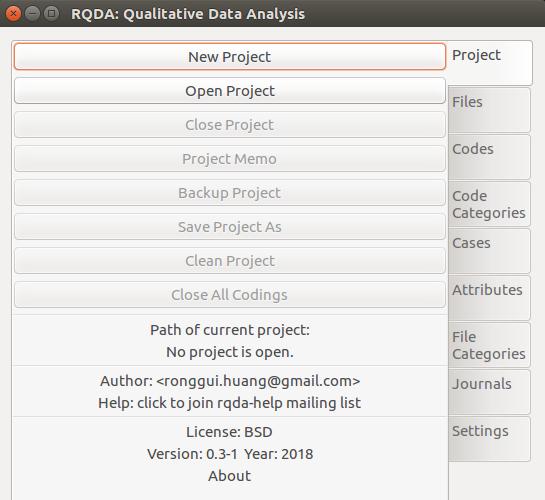
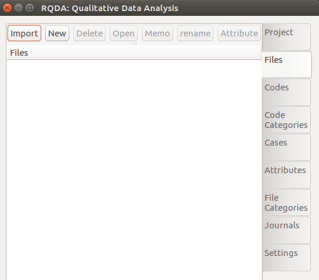
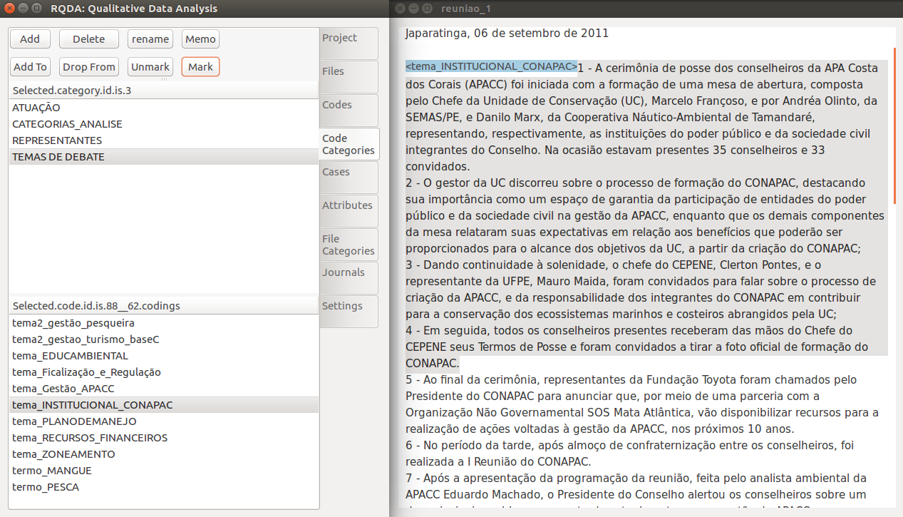

```{r setup, include=FALSE}
knitr::opts_chunk$set(echo = TRUE)
```

# Introduction

This work aims to develop a methodology for the analysis of the degree of participation of sectors in public counsils. Based of the meetings regristration documents we are able to perform text classification and text mining techniques to measure the performace of this sectors on the counsil. For demonstration we've collected 23 documents registrating the speeches and decisions made in the management counsil of a marine protected area in Brazil, the CONAPAC (Conselho da Área de Proteção Ambiental Costa dos Corais).

# Methodology Guide

### 1. Undersatanding Content Analysis and Text Mining

### 2. Theoretical Foundations and Categories

Once you have the register of the meeting, you are able to build the categories which will be marked on the documents. These categories are derived from the theoretical framework and context knowledge of the researcher. In this analysis I've 3 blocks od categories: **(1) Themes of the debates**, which were extracted from 2 interviews with specialists, observation of 3 meetings and a previous reading of the documents; (2) **Speech Bias**, wich reflect the sector that one counselor is defeding in a particular speech; (3) **Analysis Category** that are based on the foundations of a deliberative institution (Almeida e Cunha, 2011) and (4) **Counselor Speech** that codifies the speech of a particular counselor, which will be aggregated into the sectors that they represent.


| **Information**                            | **Aggregation Level**  | **Years** |   **Source**         |         
| ------------------------------------------ |:----------------------: | :------------------: | :-----------:
| Consumo médio percapita de água            | Município        | 2001 até 2017 | SNIS |
| Índice de esgoto tratado referido à água consumida | Município | 2001 até 2017 | SNIS |
| IN049-Índice de perdas na distribuição           | Município | 2001 até 2017 | SNIS |
| Índice de atendimento total de água        | Município | 2001 até 2017 | SNIS |
| Índice de atendimento total de esgoto referido aos municípios atendidos com água | Município | 2001 até 2017 | SNIS |


### 3. Installing and Loading the Packages

```{r}
# define packages to be used
packages <- c('RQDA', 'dplyr', 'ggplot2', 'stringr', 'readxl')
```

```{r, eval = F}
# install all packages
lapply(packages, install.packages, character.only = TRUE)
```

```{r,  results='hide',message=FALSE, warning=FALSE}
# load all packages
lapply(packages, require, character.only = TRUE)
```

## 4. Using RQDA for codification 


```{r, eval = F}
# execute RQDA
RQDA()
```

Após carregar e executar o pacote, será berta uma janela externa. Crie um novo projeto e nomei-o como desejar. Em seguido será mostrado as opções do projeto. Vá em "Files" e em seguida importe o arquivo .txt que será analisado.





Após importados os arquivos vá em codes e crie os códigos necessários para sua análise. No caso implementado foram utilizados códigos relativos aos temas de debate e também cada representante recebeu um código, de forma que ao final da codificação haja uma contagem de quantas vezes foram debatidos cada tema e quantas vezes cada representante levantou voz no Conselho. Para codificar, selecione com o cursor do mouse o texto para codificação e clique em "Mark".



### 2.1 Saliência de Temas

Após as codificações completadas as codificações dos temas debatidos nas reuniões, é possível responder à pergunta "quais são os temas mais e menos debatidos nas reuniões do Conselho". Essa informação reflete qual o foco do Conselho de modo a identificar quais temas são mais salientes ou problemáticos para os atores do contexto em questão. Abaixo seguem os códigos necessários para capturar as informações relativas aos códigos.

```{r, eval = FALSE, echo=FALSE, results='hide',message=FALSE}
# salvar codigos em arquivo para leitura markdown
sumario_cod <- summaryCodings()
cont_cod_data <- data.frame(sumario_cod$NumOfCoding)
write.csv(cont_cod_data, "Dados/cont_cod_data.csv", row.names = F)

# infos sobre cada codificacao
coding_table <- getCodingTable()
write.csv(coding_table, "Dados/coding_table.csv", row.names = F)
```

```{r, eval = FALSE}
# capturar informacoes dos codigos
sumario_cod <- summaryCodings()

# selecionar contagem de cada codigo
cont_cod_data <- data.frame(sumario_cod$NumOfCoding)
```

```{r, echo=FALSE, results='hide',message=FALSE}
cont_cod_data <- read.csv("data/cont_cod_data.csv")
coding_table <- read.csv("data/coding_table.csv")
```

```{r}
# selecionar codigos relativos ao tema 
# (durante a codificacao foi usado o termo 'tema_' para ajudar na separacao das informacoes)
cont_cod_tema <- cont_cod_data[str_detect(cont_cod_data$Var1, "tema_"),]

# visualizar base
cont_cod_tema

# criar variavel de  proporcao de cada tema em relacao ao total
cont_cod_tema <- mutate(cont_cod_tema, prop_tema = round((Freq / sum(Freq))*100, 2) )

# ordenar os valores
cont_cod_tema$Var1 <- factor(cont_cod_tema$Var1, 
                             levels = cont_cod_tema$Var1[order(cont_cod_tema$prop_tema)])

# visualizar graficamente e salvar
ggplot(cont_cod_tema, aes(x = Var1, y = prop_tema))+
  geom_bar(stat = "identity", fill = "#15041c") +
  geom_label(aes(x = Var1, y = prop_tema, label = prop_tema), size = 3.5)+
  labs(y = "Procentagem do Total", x = "", title = "") +
  coord_flip()+
  ggsave("prop_debate_tema.png", path = "results",width = 7, height = 3, units = "in")
```

### 2.2 Proporção de Fala

Outra possibilidade é a contagem de situções de fala por grupo de interesse. Isso é de extrema importância e uma análise inovadora visto que a maioria das análises de participação consideram apenas a presença dos representantes em plenária, enquanto a preponderância da fala fica à margem. A fala assume um caráter essencial no debate público, visto que é a partir da racionalização discursiva e do processo comunicativo que os atores conseguem chegar a decisões coletivas (HABERMAS).

```{r}

# selecionar codigos que nao sao de representantes 
paste_voz<- c("cat_", "tema_", "DESTAQUES", "DUVIDA_", "atua_", "DECISOES", "termo_", "tema2_", "IDENT_MEMO")
cont_cod_rep <- cont_cod_data[!str_detect(cont_cod_data$Var1, paste(paste_voz, collapse = '|')),] 

# Carregar base de dados de conselheiros e categorias das suas respectivas intituicoes
representantes_instituicoes_apacc <- read_excel("data/representantes_instituicoes_apacc.xlsx")

# funcao para padronizar nomes
cleanString <- function(x){
  library(plyr); library(stringi); library(stringr)
  x_mani = stri_trans_general(x, "Latin-ASCII")%>%
    str_replace_all("_", " ")%>%
    tolower()
  return(x_mani)
}

# executa funcao
representantes_instituicoes_apacc$nome_consel <- cleanString(representantes_instituicoes_apacc$nome_consel)
cont_cod_rep$nome_consel <- cleanString(cont_cod_rep$Var1)

# mergir bases
participaData <- merge(cont_cod_rep, representantes_instituicoes_apacc, by = "nome_consel") 

# retirar contagem do presidente do conselho e dos analistas*
participaData <- participaData[participaData$entidade_sigla != "ICMBIO",]

# contagem por grupo
participa_cont <- aggregate(participaData$Freq, by=list(Category=participaData$categoria1), FUN=sum)

# inserir info de assentos na base
participa_cont$numero_assentos <- c(6, 6, 12, 8, 3, 3)

# calcular proporcionalidade
participa_cont <- mutate(participa_cont, participaProp = round((x/numero_assentos),1))

# renomear para grafico
participa_cont$Category <- as.character(participa_cont$Category)
participa_cont$Category[6] <- "Organizações de educação e cultura \n e associações comunitárias"

# ordenar
participa_cont$Category <- factor(participa_cont$Category, 
                              levels = participa_cont$Category[order(participa_cont$participaProp)])
# grafico comparativo
ggplot(participa_cont, aes(x = Category, y = participaProp))+
  geom_bar(stat = "identity", fill = "#15041c") +
  geom_label(aes(label = participaProp), size = 3.5)+
  labs(y = "Número de Situações de Fala por Assento", x = "", title = "") +
  coord_flip()+
  ggsave("prop_voz_cat.png", path = "results", width = 8, height = 3, units = "in")

```

### 2.3 Relação entre Conselheiros e Atuação Política

Uma outra possibilidade de análise é identificar a relação entre grupos e temas. Isso demonstra não só o nível de engajamento dos grupos mas em quais temas e interesses cada grupo direciona seu poder de atuação. A partir da identificação dos principais interesses em jogo no Conselho, a partir da literatura e de trabalhos qualitativos com os conselheiros, foi possível identificar as atuações no sentido da (1) conservação do meio ambiente, (2) desenvolvimento do turismo local e (3) proteção e desenvolvimento da atividade pesqueira.

"Heriberto, Marcelo, Iran, Bruno, Karine foram alguns dos conselheiros que se expressaram contra a liberação de mais uma piscina para visitação, salientando a saturação da área de Maragogi como motivo."

```{r, results='hide',message=FALSE, warning=FALSE}
# selecionar codigos de conselheiros e atuacao
paste_atua <- c("convidad_","cat_", "tema_", "DESTAQUES", "DUVIDA_", "DECISOES", "termo_", "tema2_", "_1", "IDENT_MEMO")
code_atua <- cont_cod_data$Var1[!str_detect(cont_cod_data$Var1, paste(paste_atua, collapse = '|'))]
code_atua <- as.character(code_atua)

# capturar relacoes de inclusao
include_matrix <- crossCodes(codeList = code_atua, 
                           data = coding_table, 
                           relation = "inclusion")
```

```{r, results='hide',message=FALSE, warning=FALSE, eval=FALSE}
matrix <- include_matrix
grupo = 2
dataGrupo = representantes_instituicoes_apacc
```


```{r, eval=F}
# funcao para extrair numeros de string
regNum <- function(string){
  cod_seq <- regmatches(string, gregexpr("[[:digit:]]+", string))
  cod_seq <- as.numeric(unlist(cod_seq))
  return(cod_seq)
}

#===== funcao para padronizar base de dados =====#
dataNetworkProcess <- function(matrix, dataGrupo, grupo = 2){
  # tranformar em banco de dados
  data = data.frame(as.table(matrix))   
  # criar base com nomes, numeros dos codigos e grupos
  code_names = data.frame(code_full = data$Var1[!duplicated(data$Var1)],code_num = "", code_nome = "", grupo = "")
  # seleciona apenas numeros
  code_names$code_num = regNum(code_names$code_full)
  # seleciona nao parentesis
  code_names$code_nome = gsub("\\s*\\([^\\)]+\\)","",as.character(code_names$code_full))
  # cria grupos com base no tipo de categoria
  code_names$grupo = as.character(code_names$grupo)
  if (grupo == 1){
    code_names = mutate(code_names, grupo = ifelse(str_detect(code_nome, "atua"), "Atuação nos Debates", "Representante")) 
  } 
  if (grupo == 2){
    # mergir infos
    dataGrupo$nome_consel = cleanString(dataGrupo$nome_consel)
    code_names$nome_consel = cleanString(code_names$code_nome)
    code_names = merge(code_names, dataGrupo, by = "nome_consel", all = T)
    code_names = code_names[!is.na(code_names$code_full),]
    code_names$grupo = code_names$categoria1
    code_names$grupo[is.na(code_names$grupo)] <- "ATUAÇÃO"
  }
  # remover casos NA e 0 da base
  data = data[!is.na(data$Freq),]        
  data = data[data$Freq != 0,]
  # 
  listaRetorno = list(data, code_names, grupo)
  return(listaRetorno)
}

dataNetwork <- dataNetworkProcess(include_matrix, representantes_instituicoes_apacc)[[1]]
code_names <- dataNetworkProcess(include_matrix, representantes_instituicoes_apacc)[[2]]
grupo <- dataNetworkProcess(include_matrix, representantes_instituicoes_apacc)[[3]]

# criar IDs
dataNetwork$nod_cod <- regNum(dataNetwork$Var1)
dataNetwork$IDsource <- match(dataNetwork$nod_cod, code_names$code_num)-1 
dataNetwork$IDtarget <- match(dataNetwork$Var2, code_names$code_num)-1
```

```{r, eval=FALSE,  results='hide',message=FALSE, warning=FALSE}
# remover nodes sem conexoes
dataNetwork$code_full = dataNetwork$Var1
code_namesx <- merge(code_names, dataNetwork, by = "code_full")
code_namesx <- code_namesx[!duplicated(code_namesx$code_full),]
code_namesx$code_full <- as.character(code_namesx$code_full)

# definir cores dos nodes
#if (grupo == 1){
#  ColourScale <- 'd3.scaleOrdinal()
#  .domain(["Atuação nos Debates", "Representante"])
#  .range(["#FF6900", "#694489"]);' 
#}
```

```{r,  eval=F}
#if (grupo == 2){
ColourScale <- 'd3.scaleOrdinal()
.domain(["ATUAÇÃO","Gestão Pública", "ONGs Ambientalistas", "Atividade Turística", "Organizações de educação e cultura e associações comunitárias", "Atividade Pesqueira", "Instituição de Ensino e Pesquisa", "Agricultura, Indústria e Comércio"])
.range(["#000000","#E84A5F", "#FF847C", "#99B898", "#9DE0AD", "#547980", "#F7DB4F", "#2F9599"]);' 
#}
```

```{r,  eval=F}
#===== NETWORKD3 ======#
library(networkD3)
network_rep_atua <- forceNetwork(dataNetwork, Nodes = code_names, 
                                 Source = "IDsource",  Target = "IDtarget",
                                 Value = "Freq",  NodeID = "code_nome",  Group = "grupo",
                                 opacityNoHover = 1, linkDistance = 100, opacity = 1, legend = T,  
                                 height = 500, width = 800, zoom = TRUE , fontSize = 11,
                                 fontFamily = "serif", colourScale = JS(ColourScale) )

#network_rep_atua

#saveNetwork(network_rep_atua, file = 'network_rep_atua.html', selfcontained=TRUE)
```

